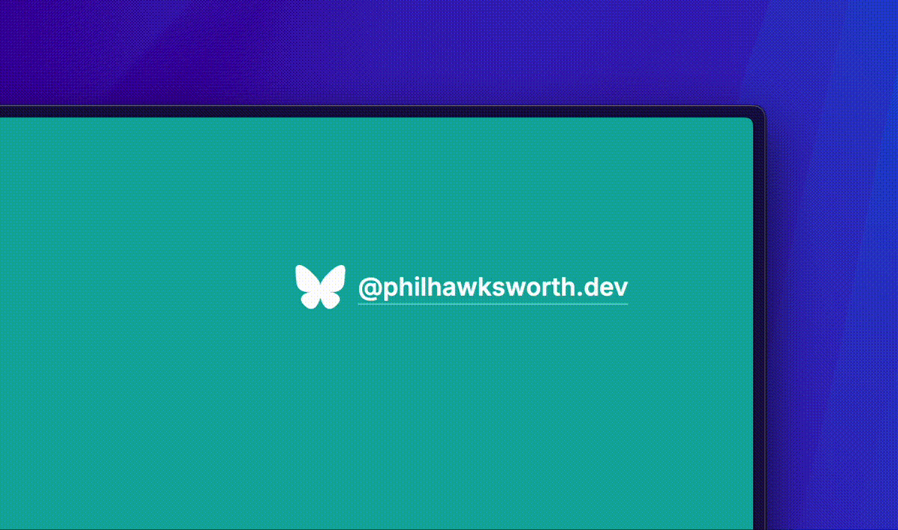

# Flutterby

An animated icon for your Bluesky profile link.

https://flutterby.philhawksworth.dev

Add the HTML and CSS to your site to provide a subtly animated wing flap of the Bluesky logo. The animation is minimised for users who prefer reduced motion.

## Using the animated icon

Add the HTML and CSS to your site. The icon's size can be controlled with CSS, and its color will be inherited from the `color` of your containing element via the `currentColor` value.

## Building

The project is built with [Lume](https://lume.land) with used Deno. To build the project locally, first ensure that you have [Deno installed](https://deno.com) and then run `deno task build`.

### What is the build for?

The build just provides some templating and minification for the HTML and CSS in the site that accompanies this repo. (https://flutterby.philhawksworth.dev). You do not need to build this yourself in norder to get the animated logo, just [visit the site](https://flutterby.philhawksworth.dev) to grab the HTML and CSS.

## Attribution

The icon is based on the Bluesky logo, which is a trademark and may be subject to a separate license.

Attribution of this animation effect back to me is not required, but always appreciated.

